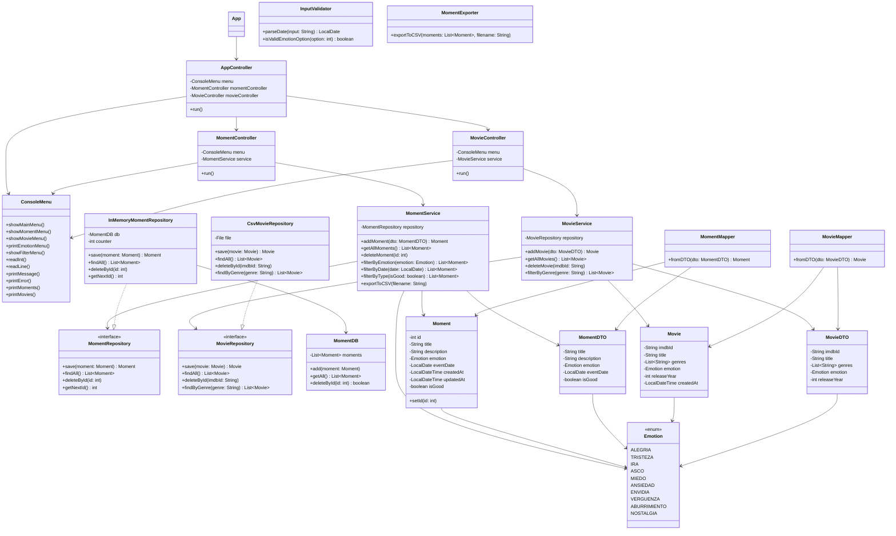

# 📓 Project Inside Out

---

## 📖 Descripción  

**Project Inside Out** es una aplicación de consola en Java que permite registrar, consultar, eliminar y filtrar momentos vividos, cada uno asociado a una emoción y una fecha.  

**Funcionalidades principales:**  
- Añadir nuevos momentos con título, descripción, emoción y fecha.  
- Listar todos los momentos registrados.  
- Eliminar momentos por su identificador.  
- Filtrar por emoción o por fecha.  

---

## 📋 Pre-requisitos  

Para ejecutar este proyecto necesitas:  

- **Java 21**  
- **Maven 3.6.3** o superior  
- Un IDE compatible con Maven (por ejemplo: IntelliJ IDEA, Eclipse, VS Code con extensión Java)  

---

## ⚙️ Instalación  

1️⃣ **Clonar el repositorio:**  
\`\`\`bash
git clone https://github.com/miguelbac/project-java-consoleapp-inside-out.git
\`\`\`

2️⃣ **Acceder al directorio del proyecto:**  
\`\`\`bash
cd project-java-consoleapp-inside-out
\`\`\`

3️⃣ **Compilar el proyecto:**  
\`\`\`bash
mvn clean install
\`\`\`

---

## ▶️ Ejecución  

Para ejecutar la aplicación desde la consola:  
\`\`\`bash
mvn exec:java -Dexec.mainClass="org.factoriaf5.project_inside_out.Main"
\`\`\`

---

## 🧪 Ejecución de tests  

Para ejecutar los tests:  
\`\`\`bash
mvn test
\`\`\`

**Dependencias de testing:**  
- **JUnit 5.6.0**  
- **Mockito 5.18.0**  
- **Hamcrest 2.2**  

---

## 📊 Diagramas  

---

## 👥 Autores  

- **Miguel Ballesteros**
- **Saúl Otero**
